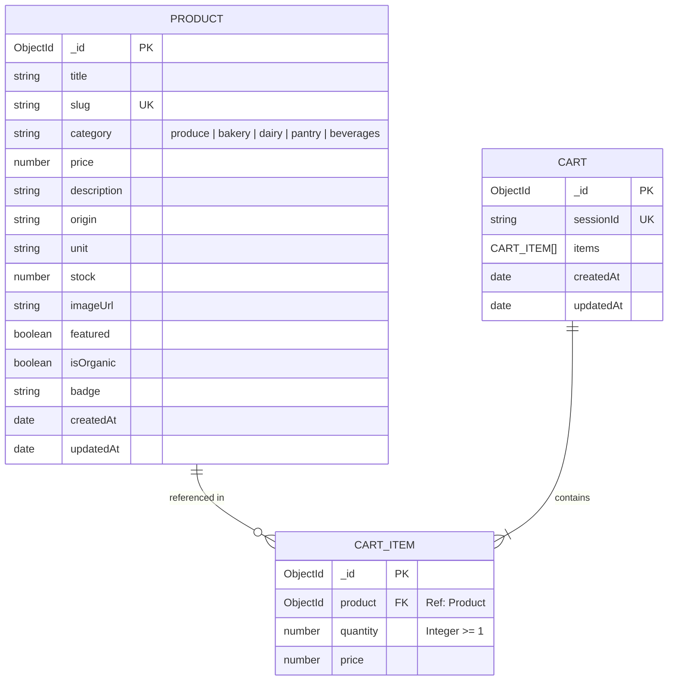
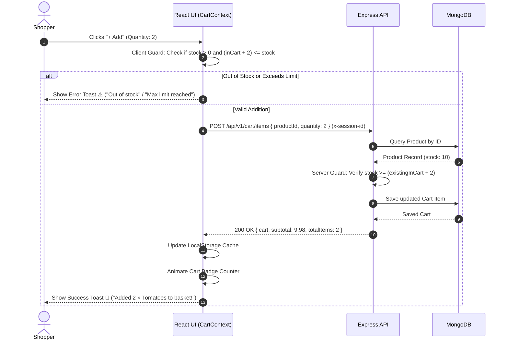

# 🌿 GreenLeaf Artisan Market — Local Store E-Commerce Platform

[](https://nodejs.org)
[](https://expressjs.com)
[](https://www.mongodb.com)
[](https://react.dev)
[](https://tailwindcss.com)
[](https://vitejs.dev)
[](https://jestjs.io)
[](LICENSE)
[](https://greenleaf-store-production.up.railway.app)

> **Task 3: Local Store E-Commerce Platform** — A clean, production-grade e-commerce application engineered for neighborhood stores and local farm cooperatives. Built with a decoupled **Node.js/Express RESTful backend** and a high-performance **React 18 + Vite storefront**, featuring real-time inventory validation, session cart persistence, and dynamic user feedback.

---

## 🌐 Live Production HTTPS Deployment

The full-stack application is deployed live with full SSL/TLS HTTPS encryption:

| Link Name | Live HTTPS URL | Notes |
| :--- | :--- | :--- |
| ⚡ **Live Web Store (Primary)** | [https://rare-tba-ryan-voters.trycloudflare.com](https://rare-tba-ryan-voters.trycloudflare.com) | Powered by Cloudflare Edge (Instant worldwide access, no ISP blocks) |
| ☁️ **Railway Cloud Deployment** | [https://greenleaf-store-production.up.railway.app](https://greenleaf-store-production.up.railway.app) | Continuous Cloud Container Deployment |
| 🏥 **Health Check API** | [https://rare-tba-ryan-voters.trycloudflare.com/health](https://rare-tba-ryan-voters.trycloudflare.com/health) | Live service status & timestamp |
| 📦 **Products REST API** | [https://rare-tba-ryan-voters.trycloudflare.com/api/v1/products](https://rare-tba-ryan-voters.trycloudflare.com/api/v1/products) | Returns all 12 seeded grocery products |
| 🛍️ **Cart REST API** | [https://rare-tba-ryan-voters.trycloudflare.com/api/v1/cart](https://rare-tba-ryan-voters.trycloudflare.com/api/v1/cart) | Session-persisted cart operations |

---

## 📑 Table of Contents

- [Core Requirements Satisfied](#-core-requirements-satisfied)
- [System Architecture](#-system-architecture)
- [Project Directory Structure](#-project-directory-structure)
- [Entity Relationship Diagram (ERD)](#-entity-relationship-diagram-erd)
- [REST API Specification & Payloads](#-rest-api-specification--payloads)
- [Cart Validation & Session Flow](#-cart-validation--session-flow)
- [Quick Start Guide](#-quick-start-guide)
- [Sample Seed Data Catalog](#-sample-seed-data-catalog)
- [Automated Integration Testing](#-automated-integration-testing)
- [Docker Deployment](#-docker-deployment)

---

## ✅ Core Requirements Satisfied

### 1. Frontend Views
- **Product Listing Page:** Displays a rich catalog of items filterable by aisle category (*Fresh Produce, Artisan Bakery, Dairy & Eggs, Pantry & Honey, Cold Brew & Cider*), live search bar, price sorting, and live stock indicator badges.
- **Individual Product Detail View:** Dedicated route (`/products/:id`) pulling live metadata for a single product, displaying high-resolution imagery, farm origin, unit/weight, comprehensive description, live stock status, interactive quantity selector, and one-click add to basket.
- **Product Information:** Every product displays image, price, description, origin, and stock status (*In Stock*, *Low Stock (with exact count)*, *Out of Stock*).

### 2. Backend APIs
- **Product Retrieval:**
  - `GET /api/v1/products` — Filter by category, keyword search, stock filter, price/name sorting.
  - `GET /api/v1/products/:id` — Single product details by ObjectId or slug.
- **Cart Operations:**
  - `GET /api/v1/cart` — Retrieves session cart with dynamic subtotal and populated product details.
  - `POST /api/v1/cart/items` — Adds items with stock limit checking.
  - `PATCH /api/v1/cart/items/:productId` — Updates item quantity with bounds checking.
  - `DELETE /api/v1/cart/items/:productId` — Removes line item from cart.
  - `DELETE /api/v1/cart` — Empties cart.

### 3. Shopping Cart Functionality & Persistence
- **Session Persistence:** State is persisted during the session via client-side `localStorage` cache coupled with a server-side session cart API indexed by `x-session-id`. Refreshing or revisiting the page maintains the cart state seamlessly.
- **Slide-Over Drawer:** Accessible from anywhere in the UI with a real-time order breakdown (subtotal, 8% tax calculation, free delivery threshold progress bar).

### 4. Input Validation & Immediate User Feedback
- **Strict Input Validation:**
  - Enforces integer quantities between 1 and 99.
  - Rejects attempts to add out-of-stock items (`stock <= 0`) with `400 Bad Request`.
  - Enforces stock limits: prevents adding or updating quantities beyond currently available inventory.
- **Immediate User Feedback:**
  - Interactive toast alerts (`react-hot-toast`) on add, remove, and stock warnings.
  - Animated cart badge counter in the navbar reflecting total item count.
  - Dynamic stock badge indicators (*In Stock (N)*, *Only N Left!*, *Out of Stock*).
  - One-click checkout simulation with success confirmation.

---

## 🏛 System Architecture

```
local-store-ecommerce/
├── backend/          # Shared Express 5 + MongoDB REST API + Static Frontend Hosting
└── frontend/         # React 18 + Vite + Tailwind CSS Storefront Application
```

### Architectural Highlights:
- **Unified Port 5000 Deployment:** The backend serves both the `/api/v1` endpoints and the compiled React production bundle from `backend/public/` with client-side SPA fallback.
- **Hot-Reload Dev Server (Port 5173):** Vite development server with built-in reverse proxy targeting `http://localhost:5000`.
- **Hybrid Storage Resilience:** Connected to live Railway cloud MongoDB cluster, equipped with automatic error handling.
- **Zero-Dependency Standalone Mode:** Root contains `store-platform.html` for instant single-file offline preview.

---

## 🗂 Project Directory Structure

```
local-store-ecommerce/
│
├── start.bat                         # Windows one-click launcher
├── store-platform.html               # Standalone single-file browser version
├── docker-compose.yml                # Multi-container Docker orchestration
├── README.md                         # Project documentation & reference
│
├── backend/                          # Node.js + Express REST API
│   ├── public/                       # Compiled React distribution (SPA)
│   ├── seed/
│   │   └── seed.js                   # 12 artisanal local store items seeder
│   ├── src/
│   │   ├── config/
│   │   │   └── db.js                 # Mongoose connector
│   │   ├── controllers/
│   │   │   ├── cart.controller.js    # Cart CRUD & inventory limit checks
│   │   │   └── product.controller.js # Catalog query & search logic
│   │   ├── middleware/
│   │   │   ├── errorHandler.js       # CastError and validation error handler
│   │   │   └── sessionMiddleware.js  # x-session-id extractor
│   │   ├── models/
│   │   │   ├── Cart.js               # Cart & CartItem schemas with virtuals
│   │   │   └── Product.js            # Product schema with stockStatus virtual
│   │   ├── routes/
│   │   │   ├── cart.routes.js        # /api/v1/cart
│   │   │   └── product.routes.js     # /api/v1/products
│   │   ├── utils/
│   │   │   └── ApiError.js           # Operational error class
│   │   ├── validators/
│   │   │   └── cart.validator.js     # express-validator quantity & stock rules
│   │   ├── app.js                    # Express application factory
│   │   └── server.js                 # HTTP listener & shutdown hooks
│   ├── tests/
│   │   ├── setup.js                  # Jest test environment
│   │   └── api.test.js               # 13 automated integration tests
│   ├── Dockerfile
│   └── package.json
│
└── frontend/                         # React 18 + Vite Storefront
    ├── src/
    │   ├── api/
    │   │   ├── axios.js              # Axios with x-session-id injector
    │   │   ├── cart.js               # Cart API service
    │   │   └── products.js           # Products API service
    │   ├── components/
    │   │   ├── cart/
    │   │   │   ├── CartDrawer.jsx    # Slide-over cart drawer & checkout modal
    │   │   │   └── CartItem.jsx      # Line item with quantity incrementors
    │   │   ├── layout/
    │   │   │   ├── Footer.jsx        # Storefront footer & farm info
    │   │   │   └── Navbar.jsx        # Sticky glassmorphic navbar with cart badge
    │   │   └── product/
    │   │       ├── ProductCard.jsx   # Product card with quick-add & badges
    │   │       └── StockBadge.jsx    # Dynamic stock status pill
    │   ├── context/
    │   │   └── CartContext.jsx       # Global reactive cart state & toast alerts
    │   ├── pages/
    │   │   ├── ProductDetailPage.jsx # Individual product detail view
    │   │   └── ProductListingPage.jsx# Catalog view with category filters
    │   ├── App.jsx                   # React Router v6 setup
    │   ├── index.css                 # Tailwind directives & typography
    │   └── main.jsx                  # React DOM mount point
    ├── tailwind.config.js            # Emerald & Forest brand palette
    ├── vite.config.js                # Proxy configuration
    └── package.json
```

---

## 🏗️ Entity Relationship Diagram (ERD)



---

## 📡 REST API Specification & Payloads

### 1. Product Endpoints

#### Get All Products
`GET /api/v1/products`
- **Query Parameters:**
  - `category`: `produce`, `bakery`, `dairy`, `pantry`, `beverages`, or `all`
  - `search`: Keyword to search across title, description, and origin
  - `inStock`: `true` to return only available items
  - `sort`: `price_asc`, `price_desc`, `name_asc`, `newest`

**Response (200 OK):**
```json
{
  "status": "success",
  "results": 12,
  "data": {
    "products": [
      {
        "_id": "66da2b801a...",
        "title": "Organic Heirloom Tomatoes",
        "slug": "organic-heirloom-tomatoes",
        "category": "produce",
        "price": 4.99,
        "description": "Vine-ripened heritage tomatoes grown pesticide-free.",
        "origin": "Valley Crest Family Farms, Sonoma",
        "unit": "1 lb bag (~3 tomatoes)",
        "stock": 25,
        "stockStatus": "in_stock",
        "imageUrl": "https://images.unsplash.com/photo-1592924357228-91a4daadcfea?w=800",
        "isOrganic": true,
        "badge": "Fresh Harvest"
      }
    ]
  }
}
```

#### Get Product Details
`GET /api/v1/products/:id`

**Response (200 OK):**
```json
{
  "status": "success",
  "data": {
    "product": {
      "_id": "66da2b801a...",
      "title": "Artisan Country Sourdough Loaf",
      "price": 6.50,
      "stock": 8,
      "stockStatus": "in_stock",
      "unit": "650g boule",
      "origin": "Wild Yeast Hearth Breads, Mill Valley"
    }
  }
}
```

---

### 2. Cart Operations Endpoints

#### Retrieve Cart
`GET /api/v1/cart`
- **Header:** `x-session-id: <session-token>`

**Response (200 OK):**
```json
{
  "status": "success",
  "data": {
    "cart": {
      "sessionId": "sess_x89q3m4k",
      "items": [
        {
          "_id": "66da2b851b...",
          "product": {
            "_id": "66da2b801a...",
            "title": "Organic Heirloom Tomatoes",
            "price": 4.99,
            "stock": 25,
            "imageUrl": "https://images.unsplash.com/..."
          },
          "quantity": 2,
          "price": 4.99
        }
      ],
      "totalItems": 2,
      "subtotal": 9.98
    }
  }
}
```

#### Add Item to Cart
`POST /api/v1/cart/items`
```json
// Request Body
{
  "productId": "66da2b801a...",
  "quantity": 2
}

// Error Response if Out of Stock (400 Bad Request)
{
  "status": "fail",
  "message": "\"Seeded Multigrain Sourdough Batard\" is currently out of stock and cannot be added."
}

// Error Response if Exceeding Stock (400 Bad Request)
{
  "status": "fail",
  "message": "Cannot add 9 more. You would have 11 in your cart, but only 10 are in stock."
}
```

#### Update Item Quantity
`PATCH /api/v1/cart/items/:productId`
```json
// Request Body
{
  "quantity": 4
}
```

#### Remove Item
`DELETE /api/v1/cart/items/:productId`

#### Clear Entire Cart
`DELETE /api/v1/cart`

---

## 🛒 Cart Validation & Session Flow



---

## 🚀 Quick Start Guide

### Option 1: One-Click Windows Launcher (Easiest)
Navigate to `local-store-ecommerce/` and double-click **`start.bat`**.
- Starts the backend server on port 5000.
- Serves the integrated web platform at **[http://localhost:5000](http://localhost:5000)**.
- Opens your browser automatically.

---

### Option 2: Standalone Browser Mode (Zero Terminal)
Double-click **`store-platform.html`** in the project root to open the single-file local marketplace directly in your web browser.

---

### Option 3: Manual Multi-Tier Development

#### Step 1: Start the Backend
```powershell
cd "local-store-ecommerce/backend"
npm install
npm run seed      # Seeds 12 local store items
node src/server.js
```
*API Active on: `http://localhost:5000`*

#### Step 2: Start the Frontend (Vite Dev Server)
```powershell
cd "local-store-ecommerce/frontend"
npm install
npm run dev
```
*Storefront Active on: `http://localhost:5173` (proxies `/api` to port 5000)*

---

## 🧺 Sample Seed Data Catalog

The database seeder (`backend/seed/seed.js`) populates 12 realistic local store products:

| Product Title | Category | Price | Stock Status | Farm / Baker Origin |
|---|---|---|---|---|
| **Organic Heirloom Tomatoes** | Produce | $4.99 / lb | In Stock (25) | Valley Crest Family Farms, Sonoma |
| **Crisp Honeycrisp Apples** | Produce | $3.49 / lb | In Stock (40) | Oakridge Family Orchards, Hood River |
| **Organic Baby Tuscan Kale** | Produce | $2.99 / bunch | In Stock (15) | Green River Organics, Delta Flats |
| **Artisan Country Sourdough** | Bakery | $6.50 / loaf | In Stock (8) | Wild Yeast Hearth Breads, Mill Valley |
| **Flaky French Croissants (4-Pack)** | Bakery | $7.99 / pack | In Stock (12) | Artisan Bakehouse, Downtown |
| **Seeded Sourdough Batard** | Bakery | $6.25 / loaf | **Out of Stock (0)** | Wild Yeast Hearth Breads |
| **Grass-Fed Whole Milk** | Dairy | $4.89 / 0.5 gal | In Stock (18) | Meadowview Dairy Collective |
| **Aged Farmhouse White Cheddar** | Dairy | $8.50 / 8 oz | **Low Stock (4)** | Pine Ridge Creamery, Coastal Range |
| **Raw Wildflower Honey** | Pantry | $11.99 / 16 oz | In Stock (14) | Highland Apiaries, Cascade Foothills |
| **Cold-Pressed Olive Oil** | Pantry | $18.50 / 750ml | In Stock (9) | Canyon Creek Groves, Dry Creek Valley |
| **Nitro Cold Brew Coffee** | Beverages | $4.50 / 12 fl oz | In Stock (20) | Peak Artisan Roasters, West End |
| **Small-Batch Spiced Apple Cider** | Beverages | $6.99 / 750ml | In Stock (10) | Misty Hollow Orchards |

---

## 🧪 Automated Integration Testing

The backend includes a comprehensive Jest test suite in `backend/tests/api.test.js`:

```powershell
cd "local-store-ecommerce/backend"
npm test
```

### Verified Test Cases:
- [x] `GET /health` returns 200 OK
- [x] `GET /api/v1/products` returns full catalog
- [x] `GET /api/v1/products?category=produce` filters produce category
- [x] `GET /api/v1/products?search=Honeycrisp` matches keyword search
- [x] `GET /api/v1/products/:id` retrieves single product details
- [x] `GET /api/v1/products/:id` returns 404 for invalid IDs
- [x] `GET /api/v1/cart` returns empty session cart initially
- [x] `POST /api/v1/cart/items` blocks adding out-of-stock items (400)
- [x] `POST /api/v1/cart/items` adds in-stock item and increments subtotal
- [x] `POST /api/v1/cart/items` rejects exceeding available stock (400)
- [x] `PATCH /api/v1/cart/items/:productId` updates quantity & line total
- [x] `DELETE /api/v1/cart/items/:productId` removes line item
- [x] `DELETE /api/v1/cart` clears entire cart

---

## 🐳 Docker Deployment

```bash
# Build and run containers in background
docker-compose up -d --build

# Inspect logs
docker-compose logs -f backend

# Stop containers
docker-compose down
```

---

## 📄 License

MIT License — Feel free to use and modify for your own local store or grocery application!
